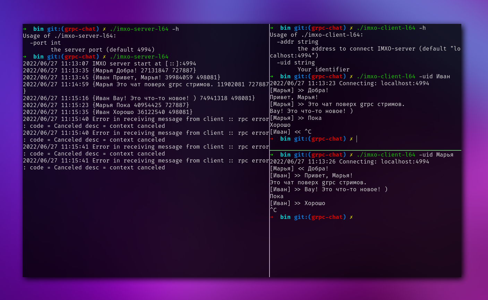

imXO
============

## [instant messenger by xo]()

---

## gRPC-Chat
imxo - instant messenger by xo



---

### Quick start

```
make build
```

```
cd bin
```
**Server**
```
./imxo-server-l64 -h        
Usage of ./imxo-server-l64:
  -port int
    	the server port (default 4994)
    	
./imxo-server-l64
```
**Clent**(s)
```
./imxo-client-l64 -h      
Usage of ./imxo-client-l64:
  -addr string
    	the address to connect IMXO-server (default "localhost:4994")
  -uid string
    	Your identifier
    	
./imxo-client-l64 -uid UserName
```